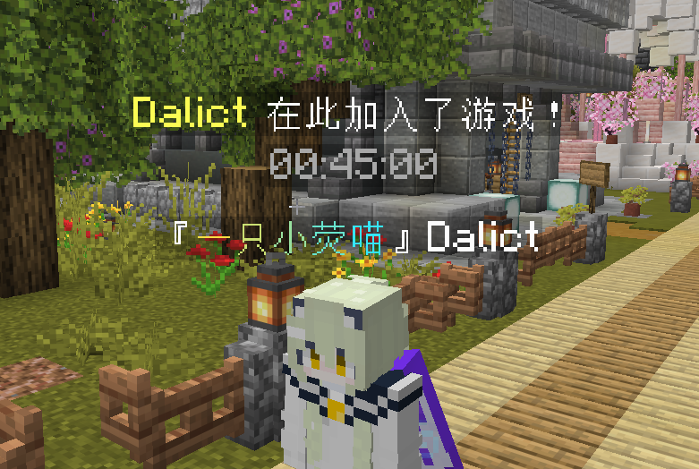
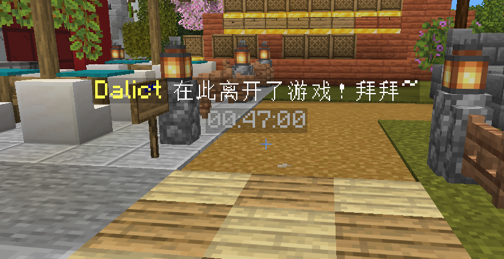

<p align="center">

</p>

<h1 align="center">JoinSuite</h1>

<p align="center">Minecraft 加入/离开综合管理插件：音效 · 悬浮文字 · 消息 · 公告</p>

<p align="center"><a href="README_EN.md">English</a> | 中文</p>

<div align="center">
    
    
    
    <br>
    
    
    
    <br>
    
    
    
</div>

---

## 简介
轻量级 **Spigot / Paper 系**（Paper / Purpur / Pufferfish / Spigot）1.19.4+ 插件，将玩家加入/离开服务器的 **音效、悬浮文字、自定义消息、欢迎公告** 一站式管理，全部支持权限分组与独立模块开关。前身为 [JoinLeaveSound](https://github.com/Dalict/JoinLeaveSound)。

---

## 效果图

**加入悬浮**（默认头顶，TextDisplay 始终朝向观察者）：



**离开悬浮**（默认脚边）：



---

## 特性
- **模块化**：音效 / 悬浮文字 / 消息 / 公告四个模块独立开关 + 独立权限节点（默认仅音效与悬浮开启）
- **权限分组**：新玩家 > 自定义权限组（自上而下） > 默认组；各功能独立回落（组里没配的功能自动用默认组）
- **悬浮文字**（1.19.4+ TextDisplay）
  - 始终朝向观察者，每个玩家视角里都面向自己
  - 多行自定义：每行独立内容、高度、持续时长，可选半透明背景
  - 16 进制颜色 `&#RRGGBB` 真彩色 + 传统 `&` 代码
  - 不写入存档，区块卸载自动丢弃，**绝无残留**；启动/区块加载时自动清扫历史残留
  - 每个玩家同一时间只有一组悬浮：新悬浮立即替换旧的，加入/离开绝不同屏、不堆叠
- **自定义消息**：替换原版加入/离开消息（默认关闭），全服广播
- **加入公告**（默认关闭）：仅加入玩家本人可见，支持聊天栏 / 大标题 / 小标题 / 动作栏，标题可调淡入、停留、淡出
- **屏蔽名单**：SQLite / MySQL 存储（`database.yml`），记录玩家名（保留大小写）与 UUID；改名自动同步；旧版 `muted-players.yml` 自动迁移
- **PlaceholderAPI 软依赖**：文本中可用任意 PAPI 占位符；对外提供 `%joinsuite_group%` `%joinsuite_muted%` `%joinsuite_time%`
- **LuckPerms 友好**：所有权限节点（含分组节点）自动注册，LP 中可 Tab 补全
- **配置自动更新**：插件升级后自动补全新增配置项，服主的修改永不丢失（旧文件备份为 `*.old`）
- 多语言（`lang/zh_CN.yml`、`lang/en_US.yml`）、OP 豁免、调试模式、音效冷却
- 零捆绑依赖（jar 约 70KB），启动无需联网下载任何库

---

## 安装
1. 将 `JoinSuite-x.x.x.jar` 放入服务器 `plugins/` 文件夹。
2. 重启服务器。
3. 编辑 `plugins/JoinSuite/` 下的配置文件进行自定义，`/joinsuite reload` 热重载。

> 要求：Spigot / Paper 系 1.19.4+，Java 17+。Paper 系走原生 Adventure API；纯 Spigot 自动切换兼容模式，功能完整。

---

## 配置文件结构

| 文件 | 用途 |
|------|------|
| `config.yml` | 全局设置（冷却、语言、时间格式、OP豁免、调试） |
| `groups.yml` | 模块开关、权限分组、新玩家/默认组/自定义组全部效果 |
| `database.yml` | 屏蔽名单存储（SQLite / MySQL） |
| `lang/zh_CN.yml` | 简体中文消息 |
| `lang/en_US.yml` | English messages |
| `muted.db` | SQLite 数据库文件（自动生成） |

---

## 命令与权限

| 命令 | 别名 | 权限 | 说明 |
|------|------|------|------|
| `/joinsuite reload` | `/jsuite reload` | `joinsuite.reload` | 重载所有配置与消息 |
| `/joinsuite mute <玩家名>` | `/jsuite mute <玩家名>` | `joinsuite.mute` | 屏蔽指定玩家（不需在线、不需进过服） |
| `/joinsuite unmute <玩家名>` | `/jsuite unmute <玩家名>` | `joinsuite.mute` | 取消屏蔽 |
| `/joinsuite list` | `/jsuite list` | `joinsuite.list` | 查看屏蔽名单 |

Tab 补全：`mute` 补全在线玩家，`unmute` 补全屏蔽名单（保留原始大小写）。

模块权限节点（默认所有人生效，可在 LP 中对个别人否定）：

| 节点 | 控制内容 |
|------|---------|
| `joinsuite.module.sound` | 音效模块 |
| `joinsuite.module.hologram` | 悬浮文字模块 |
| `joinsuite.module.message` | 自定义消息模块 |
| `joinsuite.module.announce` | 加入公告模块 |

---

## 分组系统（`groups.yml`）

### 匹配优先级（从高到低）
1. **新玩家**（首次加入且 `newbie.enabled: true`）
2. **自定义权限组**（`groups` 列表，从上到下匹配，命中即停）
3. **默认组**（`enable-default: true` 时生效）
4. **各功能独立回落**：某层未配置的功能自动取下一层

### 配置示例（节选）
```yaml
modules:
  sound:
    enabled: true
    permission: "joinsuite.module.sound"
  message:
    enabled: false
    permission: "joinsuite.module.message"

newbie:
  enabled: true
  join-hologram:
    enabled: true
    duration: 15
    background: true
    lines:
      - text: "&e{player} &f在这个位置首次加入这里！"
        height: 2.8
        duration: 15
      - text: "&7{time}"
        height: 2.5
        duration: 15
  join-announce:
    enabled: true
    mode: "title"        # chat / title / subtitle / actionbar
    text: "&e欢迎新玩家 &f{player}"
    fade-in: 10          # 仅 title/subtitle 生效（tick）
    stay: 60
    fade-out: 20

groups:
  vip:
    permission: "joinsuite.group.vip"
    join-sound:
      sound: ENTITY_PLAYER_LEVELUP
      volume: 1.0
      pitch: 1.2
    join-hologram:
      enabled: true
      duration: 15
      lines:
        - text: "&#FFAA00VIP &f{player} &7加入了游戏"
          height: 2.8
          duration: 15
```

### 权限分配示例（LuckPerms）
```
/lp user Dalict permission set joinsuite.group.admin true
/lp group vip permission set joinsuite.group.vip true
```

> 所有分组节点都会自动注册到权限注册表，在 LP 中可 **Tab 补全**。注意：分组节点注册为默认拒绝，**OP 也不会自动拥有**，需显式授予。

---

## 悬浮文字说明

- **height**：相对玩家脚下位置的高度（方格）。约 `2.4` 为头顶、`0.4` 为脚边；加入默认在头顶，离开默认在脚边
- **每行独立 duration**：省略时用该段顶层 `duration` 兜底（默认 15 秒）
- **位置精确**：悬浮生成在玩家当时站立的精确小数坐标，不吸附方块
- **防残留**：实体不写入存档；区块卸载即丢弃；启动时自动清扫旧版残留
- **单玩家单组**：新悬浮生成前会立即清除该玩家仍在显示的旧悬浮（离开后 15 秒内重进，离开悬浮立刻消失）

---

## 屏蔽名单（`database.yml`）

```yaml
type: sqlite          # sqlite 或 mysql
table-prefix: "joinsuite_"
mysql:
  host: "localhost"
  port: 3306
  database: "minecraft"
  username: "root"
  password: ""
  use-ssl: false
```

- 被屏蔽玩家的音效、悬浮、消息、公告全部不触发（保留原版加入提示）
- 屏蔽从未进过服的玩家：支持，其首次进服即生效
- 记录 UUID + 玩家名（保留大小写）；玩家上线自动补全 UUID、自动同步改名
- 旧版 `muted-players.yml` 首次启动自动迁移并备份

---

## 配置自动更新
所有配置文件带 `config-version`。插件更新后配置结构变化时，启动会自动合并：旧文件备份为 `*.old`，缺失的新键以默认值补全，**服主已修改的值一律保留**，无需删除重配。

---

## 多语言
内置 `zh_CN` / `en_US`。修改 `config.yml` 的 `language` 后重载即可切换；语言文件缺失时回退 `zh_CN`。

---

## 常见问题

**Q：支持哪些服务端？**
A：Spigot / Paper 系 1.19.4+。Paper 系使用 Adventure，纯 Spigot 自动回落旧式 API，全功能可用。

**Q：悬浮文字会残留在世界里或写进存档吗？**
A：不会。实体设置了非持久化标记，区块卸载保存时直接丢弃；另有标签清扫机制兜底。

**Q：被屏蔽的玩家进服会有什么表现？**
A：不触发本插件的任何效果（音效/悬浮/消息/公告），原版加入提示保留。

**Q：公告和消息模块有什么区别？**
A：消息模块 = 全服广播的加入/离开提示（聊天栏）；公告模块 = 只有加入玩家本人看到的欢迎信息（四种显示方式）。

**Q：为什么我的 OP 号匹配不到自定义组？**
A：分组权限节点注册为默认拒绝（为了能在 LP 中补全），OP 不再自动通过。请用 LP 显式授予，或临时调整组顺序测试。

**Q：插件需要联网下载依赖吗？**
A：不需要。jar 零捆绑依赖，数据库驱动使用服务端自带的 SQLite/MySQL 驱动。

**Q：插件升级会覆盖我改过的配置吗？**
A：不会。自动更新只补全新增的键，已有值一律保留，旧文件另存为 `*.old` 备份。

---

## 构建
```bash
mvn package
```
产物位于 `target/JoinSuite-x.x.x.jar`（版本号跳过含 4 的段）。

---

## 开源协议
MIT License，见 [LICENSE](LICENSE)。

## 支持与反馈
- 问题反馈：[GitHub Issues](https://github.com/Dalict/JoinSuite/issues)
- 源码仓库：[https://github.com/Dalict/JoinSuite](https://github.com/Dalict/JoinSuite)
